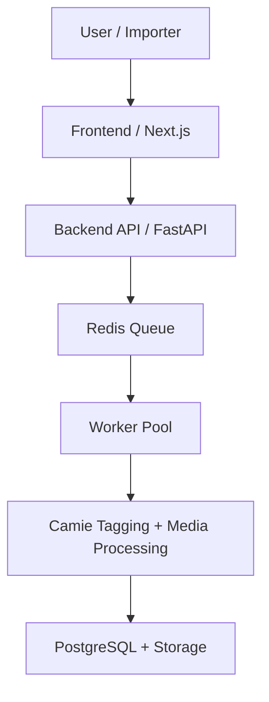

# NextBoo

[](./LICENSE)
[](./docker-compose.yml)
[](./backend)
[](./frontend)
[](./docker-compose.yml)
[](./docker-compose.yml)

**Like Booru. Reimagined.**

A modern AI-powered image index with automatic tagging, faceted search, and a scalable architecture.

## Overview

NextBoo is a self-hosted booru-style image board for curated archives, moderation-heavy workflows, and long-term media growth. It combines a classic tag-first browsing model with modern services:

- `Next.js` frontend
- `FastAPI` backend
- background media worker with Camie tagging
- `PostgreSQL` for metadata
- `Redis` for queues, runtime state, and cache

It is designed for large-scale ingest, tagging, moderation, and long-term archive maintenance, not just a gallery shell.

## Why NextBoo

Most booru implementations focus primarily on simple image hosting.

NextBoo is designed for:

- long-term curated media archives
- AI-assisted tagging pipelines
- scalable ingest and review workflows
- dataset-oriented image collections
- modern self-hosted infrastructure

It is intended to function both as a media archive and as a foundation for AI-driven dataset curation.

## Core Features

- automatic ingest for images, GIF, animated WebP, WebM, MP4, and MKV clips
- audio-preserving clip support for short videos
- Camie-based auto tagging with namespace-aware tags
- four-stage rating model:
  - `G` = General
  - `S` = Sensitive
  - `Q` = Questionable
  - `X` = Explicit
- tag browser, search filters, rating filters, media-type filters, and persistent browsing state
- comment threads with replies, votes, and moderation flagging
- image votes with per-user voting and cooldown logic
- moderation flows for reports, flagged comments, upload review, near duplicates, and danger tags
- global tag administration with aliases, merges, lock/disable states, and governance helpers
- integrated board importer with queue-backed progress logs and per-board runs
- invite-only access model with bootstrap and rescue admin invite scripts
- dynamic Terms of Service page with admin editor and forced re-acceptance flow
- worker scaling controls and autoscaler support
- Docker-first deployment

## Current Media Model

NextBoo currently distinguishes between:

- `image`
- `animated`
- `video`

The worker extracts thumbnails, derives metadata, and tags static and moving media through the same ingest pipeline. Video clips keep audio and expose runtime metadata such as duration, codecs, and audio presence.

## Feature Areas

### Browsing and Search

- tag include/exclude search
- rating filters and media-type filters
- namespace-aware tag explorer
- related image suggestions
- post detail view with grouped tag presentation
- staff-only highlighting for rating-relevant tags

### Upload and Ingest

- web upload
- ZIP import
- server-side folder import
- exact duplicate detection before worker processing
- post-ingest duplicate and moderation outcome visibility
- full retag and prune maintenance flow

### Social Layer

- image votes
- threaded comments
- comment replies
- comment votes
- auto-flagging of negatively rated comments

### Moderation and Admin

- report handling
- post edit and delete
- rating rules
- danger tag management
- near-duplicate review
- flagged comment moderation
- upload access and invite management
- user and strike administration
- worker scaling controls
- board importer monitoring and cleanup actions
- Terms of Service editor with live versioning

### Terms of Service and Account Policy

- public ToS page served directly by NextBoo
- admin-managed ToS editor with paragraph-style blocks
- invite registration requires explicit ToS acceptance
- when the ToS changes, all non-admin users must review and accept the new version again
- declining the ToS places the account into a backup-only `TOS_DEACTIVATED` state
- backup-only accounts can sign in only to access their own exports and uploaded material
- backup-only accounts are purged automatically after 14 days

### Importer

Admin-only feature.

The integrated board importer currently exposes the stable board core:

- `Danbooru`
- `E621`
- `E926`
- `Konachan`
- `Konachan.net`
- `Rule34`
- `Safebooru`
- `Xbooru`
- `Yande.re`

The importer is intentionally positioned as a powerful bootstrapping tool for building up an archive, not as a normal day-to-day user feature.

It creates normal NextBoo ingest jobs and writes per-run progress events into the admin UI.

## Architecture

Default services in the main stack:

- `frontend`: NextBoo web UI
- `backend`: FastAPI API under `/api/v1`
- `worker`: media ingest and retag processing
- `worker_autoscaler`: optional worker scaling controller
- `postgres`: metadata database
- `redis`: queue and runtime coordination



## Repository Layout

```text
backend/     FastAPI application, API routes, models, services
frontend/    Next.js application
worker/      ingest and tagging worker
autoscaler/  worker autoscaler service
scripts/     operational scripts
infra/       deployment-related assets
gallery/     runtime storage root for local development
```

## Quick Start

1. Copy `.env.example` to `.env`.
2. Adjust credentials, ports, and storage settings.
3. Start the stack:

```bash
docker compose up --build
```

4. Create the first admin invite:

```bash
./scripts/bootstrap-admin-invite.sh
```

5. Redeem the printed code at:

- `http://localhost:13000/invite`

During invite registration, the user must accept the current Terms of Service before the account can be created.

6. Open:

- frontend: `http://localhost:13000`
- backend health: `http://localhost:18000/api/v1/health`

## Screenshots

Recommended screenshots for the repository front page:

- gallery / home view
- post detail view
- admin board importer
- worker scaling admin page

Add them under a `docs/screenshots/` folder when ready and link them here.

## Admin Bootstrap and Recovery

NextBoo does **not** create a default `admin/admin`.

Use:

- `./scripts/bootstrap-admin-invite.sh`
  - creates the first admin invite only if no active admin exists
  - reads the frontend port from `.env`
- `./scripts/rescue-admin-access.sh`
  - creates an explicit rescue admin invite for recovery cases
  - reads the frontend port from `.env`

Both scripts are intended to run locally on the Docker host.

## Terms of Service Flow

NextBoo includes a built-in Terms of Service system.

- public ToS page: `/tos`
- admin editor: `/admin/tos`
- invite registration cannot complete without accepting the current ToS version
- when an admin updates the ToS, all non-admin accounts must accept the new version on their next session

If a user declines the current ToS:

- the account is switched to `TOS_DEACTIVATED`
- normal browsing, uploads, comments, votes, and social features are blocked
- the user can only sign in to access the backup page and recover their own data
- the account is automatically deleted after 14 days if it stays deactivated

## Responsibility and Safety

The person hosting NextBoo is responsible for the content they allow on their instance.

NextBoo includes moderation and review features that help operators manage uploads, comments, reports, danger tags, and archive quality. These tools assist moderation, but they do **not** replace human review, legal judgment, or local policy enforcement.

Check your ground:

- know the laws and platform rules that apply in your jurisdiction
- review what your users upload and what your instance retains
- do not assume automation alone is enough for compliance or safety

## Storage Model

Host-mounted runtime data is controlled through `GALLERY_ROOT`.

Default:

```bash
GALLERY_ROOT=./gallery
```

Mounted runtime paths below `GALLERY_ROOT`:

```text
queue/
processing/
processing_failed/
content/
content_thumbs/
imports/
models/
database/
```

## Configuration

Main settings live in `.env`.

Important variables:

- `FRONTEND_PORT`
- `API_PORT`
- `JWT_SECRET`
- `POSTGRES_*`
- `REDIS_*`
- `GALLERY_ROOT`
- `PUBLIC_API_BASE_URL`
- `CORS_ORIGINS`
- `WORKER_CONCURRENCY`
- `WORKER_CPU_LIMIT`
- `WORKER_MEMORY_LIMIT`
- `JOB_HEARTBEAT_SECONDS`
- `WORKER_PRESENCE_TTL_SECONDS`

See `./.env.example` for the baseline.

## Worker and Scaling

NextBoo supports:

- single-worker operation
- manual scaling
- autoscaler-driven scaling
- stale-job cleanup and heartbeat tracking

Operational scripts:

- `./scripts/scale-workers.sh <count>`
  - disables autoscaling first, then applies manual worker scaling
- `./scripts/worker-autoscaler.py`
  - local helper for `status`, `enable`, `disable`, and `set`
- `./scripts/release-readiness.sh`
- `./scripts/backup-nextboo.sh`
  - writes database dump, storage archives, and `.env.backup`
- `./scripts/restore-nextboo.sh`
  - asks for confirmation, restores storage and DB, then starts services again

The admin UI also exposes worker scaling state and autoscaler controls.

## Ratings and Visibility

Current rating levels:

- `general`
- `sensitive`
- `questionable`
- `explicit`

Typical visibility rules:

- guests: `general`
- signed-in users: `general` and `sensitive`
- optional access: `questionable`
- explicit opt-in: `explicit`
- staff: unrestricted for moderation

## Search Model

Search supports:

- include tags: `tag_name`
- exclude tags: `-tag_name`
- rating filter: `rating:general`
- media-type filtering through the UI
- persistent browse state through UI controls

## Deployment Notes

For a clean self-hosted layout:

- choose a dedicated app root such as `/NextBoo`
- clone the repository there
- keep runtime data under `GALLERY_ROOT`
- avoid committing `.env`, `gallery/`, or local build artefacts

## Development Notes

- backend tests live under `backend/tests`
- worker tests live under `worker/tests`
- frontend smoke and UI tests live under `frontend/tests`

## License

MIT
